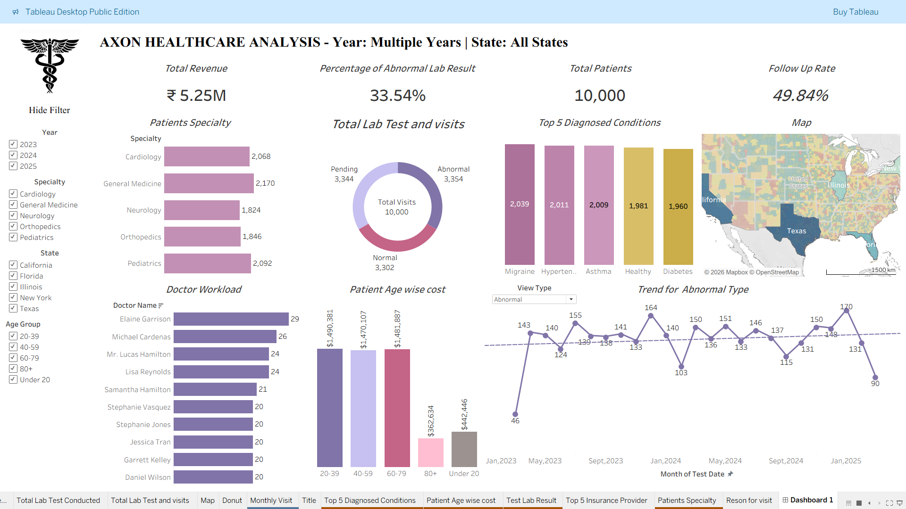

# Healthcare Data Analysis Dashboard

## 📊 Project Overview
This project focuses on analyzing healthcare data to identify key insights related to patient records, treatment costs, and hospital performance.

## 🛠 Tools Used
- Tableau
- Excel
- Data Visualization

## 📈 Key Insights
- Analyzed 10,000+ patient records
- Identified disease trends and revenue patterns
- Improved reporting efficiency

## 📷 Dashboard Preview

## 🔗 Project Files
- Tableau Dashboard (.twbx)

## 🚀 Outcome
Enabled data-driven decision-making by providing clear and interactive visual insights.
